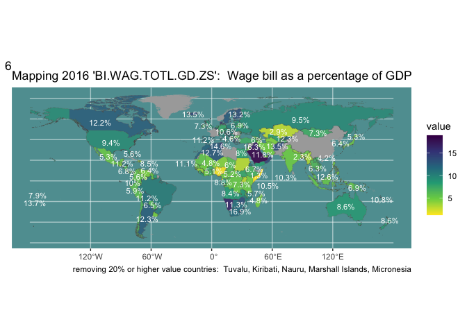

<!-- README.md is generated from README.Rmd. Please edit that file -->

# ggsomewhere

<!-- badges: start -->

<!-- badges: end -->

The goal of ggsomewhere (and it’s github repository) is to provide tools
for building spatial ggplot2 extensions.

The approach makes use of ggplot2’s sf plotting capabilities, the
sf2stat package to prepare reference data for use inside a stat\_\* or
geom\_\* layer, and the readme2pkg package functions for managing
functions from a readme and working with template functions included in
the readme.

## Fully worked example…

How you’d use sf2stat to build functionality with scope, region type,
and location name. When using the code templates for this north carolina
county example, we’ll be replacing ‘scope’, ‘region’, and ‘locations’ as
follows

  - ‘scope’ -\> ‘northcarolina’
  - ‘region’ -\> ‘county’
  - ‘locations’ -\> a vector of region names

Let’s see how we might recreate the functionality in the ggnorthcarolina
package using some templates in this readme.

In the example, the scope of the package is ‘northcarolina’. The region
of interest is ‘county’, and the location names that we are using are
the county names.

## 

``` r
devtools::create(".")
```

## Step 00. prep reference data

### Create

``` r
usethis::use_data_raw()
```

## Preparation

The reference data should have just the id columns and the geometry.
Then it should be named similar to this:

geo\_reference\_northcarolina\_county

Where ‘northcarolina’ is is the character string that will replace
‘scope’ when using the code templates, and ‘county’ is the character
string that will replace region in the

``` r
nc <- sf::st_read(system.file("shape/nc.shp", package="sf"))
#> Reading layer `nc' from data source 
#>   `/Library/Frameworks/R.framework/Versions/4.4-x86_64/Resources/library/sf/shape/nc.shp' 
#>   using driver `ESRI Shapefile'
#> Simple feature collection with 100 features and 14 fields
#> Geometry type: MULTIPOLYGON
#> Dimension:     XY
#> Bounding box:  xmin: -84.32385 ymin: 33.88199 xmax: -75.45698 ymax: 36.58965
#> Geodetic CRS:  NAD27

library(tidyverse)
rnaturalearth::ne_countries(  
  scale = "medium", returnclass = "sf") |> 
  select(name, continent, geometry, iso_a3) |>
  rename(country_name = name,
         iso3c = iso_a3
         )  ->
ref_data


geo_reference_world_country <- ref_data |>
  dplyr::select(country_name, iso3c) |>
  sf2stat:::sf_df_prep_for_stat(id_col_name = "country_name")

usethis::use_data(geo_reference_world_country, overwrite = T)
```

``` r
knitrExtra::chunk_to_dir("ne_geo_reference_prep", 
                         dir = "data-raw/")
```

## Use template to create `stat_county()` functionality

``` r
knitrExtra:::chunk_variants_to_dir(chunk_name = "stat_region_template",
                                  file_name = "stat_country.R",
                                  replace1 = "scope",
                                  replacements1 = "world",
                                  replace2 = "region",
                                  replacements2 = "country")
```

``` r
compute_panel_scope_region <- function(data, 
                                       scales, 
                                       keep_id = NULL, 
                                       drop_id = NULL, 
                                       stamp = FALSE){
  
  if(!stamp){data <- dplyr::inner_join(data, geo_reference_scope_region)}
  if( stamp){data <- geo_reference_scope_region }
  
  if(!is.null(keep_id)){ data <- dplyr::filter(data, id_col %in% keep_id) }
  if(!is.null(drop_id)){ data <- dplyr::filter(data, !(id_col %in% drop_id)) }
  
  data
  
}

# step 2
StatSfscoperegion <- ggplot2::ggproto(`_class` = "StatSfscoperegion",
                                `_inherit` = ggplot2::Stat,
                                # required_aes = c("fips|county_name"),
                                compute_panel = compute_panel_scope_region,
                               default_aes = ggplot2::aes(label = after_stat(id_col)))


stat_region <- function(
      mapping = NULL,
      data = NULL,
      geom = ggplot2::GeomSf,
      position = "identity",
      na.rm = FALSE,
      show.legend = NA,
      inherit.aes = TRUE,
      crs = "NAD27", # "NAD27", 5070, "WGS84", "NAD83", 4326 , 3857
      ...) {

  c(ggplot2::layer_sf(
              stat = StatSfscoperegion,  # proto object from step 2
              geom = geom,  # inherit other behavior
              data = data,
              mapping = mapping,
              position = position,
              show.legend = show.legend,
              inherit.aes = inherit.aes,
              params = rlang::list2(na.rm = na.rm, ...)
              ),
              
              coord_sf(crs = crs,
                       default_crs = sf::st_crs(crs),
                       datum = crs,
                       default = TRUE)
     )
  }
```

### test it out `stat_county()`

``` r
source("./R/stat_country.R")

library(ggplot2)

ref_data |>
  sf::st_drop_geometry() |>
  ggplot() +
  aes(iso3c = iso3c) +
  stat_country() + 
  aes(fill = continent)
```

<!-- -->

## Use template to create useful derivitive functions

``` r
knitrExtra:::chunk_variants_to_dir(chunk_name = "geom_region_template",
                                  file_name = "geom_country.R",
                                  replace1 = "region",
                                  replacements1 = "country",
                                  replace2 = "fips",
                                  replacements2 = "iso3c")
```

``` r
geom_region <- stat_region
geom_region_label <- function(...){stat_region(geom = "text",...)}
stamp_region <- function(...){
  stat_region(stamp = T, 
              data = mtcars,  # what if this is . %>% slice(1) to avoid the complaining
              aes(fill = NULL, color = NULL, label = NULL, 
                  fips = NULL, region_name = NULL), 
              ...)}
stamp_region_label <- function(...){
  stat_region(stamp = T, 
              geom = "text", 
              data = mtcars, 
              aes(fill = NULL, color = NULL,
                  fips = NULL, region_name = NULL), 
              ...)}
```

### try those out

``` r
source("./R/geom_country.R")


wwbi_data <- readr::read_csv('https://raw.githubusercontent.com/rfordatascience/tidytuesday/master/data/2024/2024-04-30/wwbi_data.csv')
wwbi_series <- readr::read_csv('https://raw.githubusercontent.com/rfordatascience/tidytuesday/master/data/2024/2024-04-30/wwbi_series.csv')
wwbi_country <- readr::read_csv('https://raw.githubusercontent.com/rfordatascience/tidytuesday/master/data/2024/2024-04-30/wwbi_country.csv')

indicator_code_selection <- "BI.WAG.TOTL.GD.ZS"

wwbi_series %>% 
  filter(indicator_code == indicator_code_selection) %>% 
  .[2] ->
indicator_description

wwbi_data %>% 
  filter(year == 2016) %>% 
  filter(indicator_code == indicator_code_selection) %>% 
  arrange(-value) %>% 
  filter(value >= 20) %>% 
  left_join(wwbi_country) %>% 
  pull(short_name) %>% paste(collapse = ", ") ->
removed_countries

# 1. Data, description, theme
wwbi_data %>% 
  filter(year == 2016) %>% 
  filter(indicator_code == indicator_code_selection) %>%
  filter(value < 20) %>% 
  ggplot() +
  labs(title = paste0("Mapping 2016 '", indicator_code_selection,"':  ", indicator_description)) + 
  labs(caption = paste("removing 20% or higher value countries: ", removed_countries)) + 
  theme(panel.background = element_rect(fill = "cadetblue")) + 
  theme(panel.grid = element_line(color = alpha("white", .5))) + 
  labs(tag = 1)

# Countries annotation layer
last_plot() + labs(tag = 2) +
  stamp_country(fill = "darkgray", 
                color = NA, 
                drop_id = "Antarctica")
```


``` r
# 3. add countries geom
last_plot() + labs(tag = 3) +
  aes(iso3c = country_code) + 
  geom_country(linewidth = .05, 
               alpha = .9)

# 4. add fill representation
last_plot() + labs(tag = 4) +
  aes(fill = value) + 
  scale_fill_viridis_c(direction = -1)
```


``` r
# 5 add label layer - default to country names
last_plot() + labs(tag = 5) +
  geom_country_label(check_overlap = T, 
                     color = "white", size = 3) 

# 6 change label layer to match fill representation
last_plot() + labs(tag = 6) +
  aes(label = paste0(round(value, 1), "%")) 
```



``` r
# 7 Annotation to draw attention to specific country
last_plot() + labs(tag = 7) +
  stamp_country(color = "red", 
                keep_id = "Australia", fill = NA) + 
  labs(subtitle = "Let's talk about how Australia fits in")

# 8 watermark
last_plot() + labs(tag = 8) +
  geom_text(data = . %>% slice(1), 
            aes(x = I(.5), y = I(.5)),
            label = "#TidyTuesday plot", angle = 20, 
            size = 20, 
            color = "white",
            alpha = .25)
```


## Use template to write convenience functions for each region

``` r
locations <- geo_reference_world_country$country_name
locations_snake <- tolower(locations) |> 
  stringr::str_replace_all(" ", "_")

knitrExtra:::chunk_variants_to_dir(chunk_name = "stamp_region_location", 
                                  file_name = "stamp_country_location.R",
                                  replace1 = "region",
                                  replacements1 = rep("country", length(locations)),
                              replace2 = "location",
                              replacements2 = locations_snake,
                              replace3 = "Location", 
                              replacements3 = locations)
```

``` r
#' Title
#'
#' @param ... 
#'
#' @return
#' @export
#'
#' @examples
stamp_region_location <- function(...){stamp_region(keep_id = 'Location', ...)}

#' Title
#'
#' @param ... 
#'
#' @return
#' @export
#'
#' @examples
stamp_region_label_location <- function(...){stamp_region_label(keep_id = 'Location', ...)}
```
